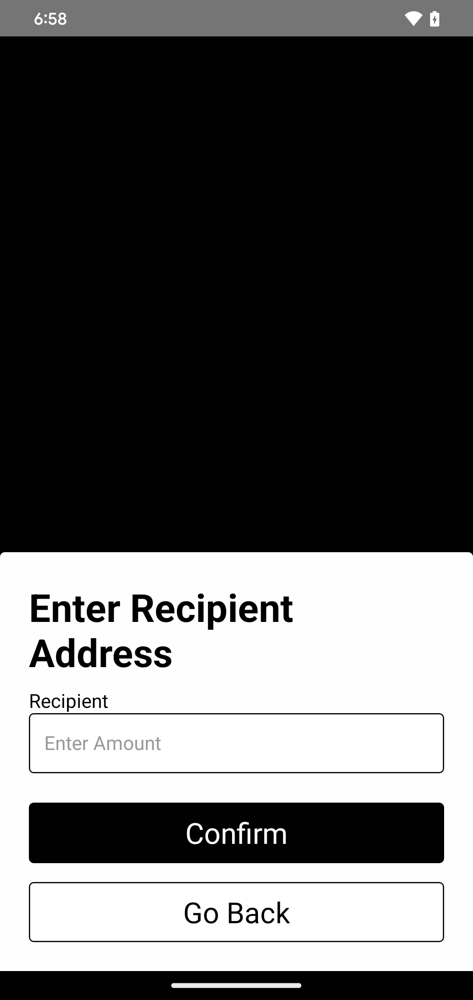
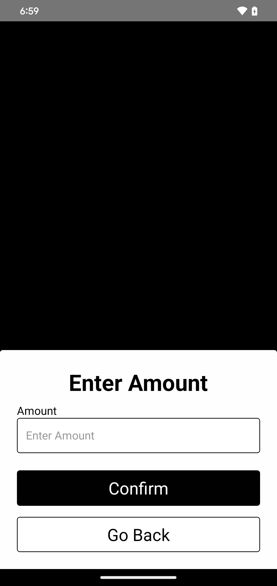

# Accept Card Payment

The `Accept` component facilitates the transfer of **tokens** by using **PhysiKey cards** to sign crypto transactions. It provides a step by step process for securely handling recipient details, amount input, NFC scanning, password validation, and transaction execution.

This component is displayed as a modal, allowing users to complete the transfer process without leaving the current screen. Its visibility is controlled by state.

<div style="display: grid; grid-template-columns: repeat(5, 1fr); gap: 16px;">
  <div style="text-align: center;">
    
  </div>
  <div style="text-align: center;">
    
  </div>
  <div style="text-align: center;">
    
  </div>
  <div style="text-align: center;">
    
  </div>
  <div style="text-align: center;">
    
  </div>
</div>

## Props
- `color` (string, optional): A hex value that determines the theme color of the component. It allows you to customize the color of buttons to match your theme.
- `recipientAddress` (string): The address that will be accepting the payments.
- `pimlicoUrl` (string): The URL of the Pimlico Paymaster service. It is used for sponsoring the transaction.
- `rpcUrl` (string): The URL of the RPC endpoint used to interact with the blockchain network.
- `tokenContract` (string): The address of the ERC-20 token contract that will be used for the transfer.
- `visible` (boolean): Determines if the `Accept` component is visible or not. It controls the modal's visibility on the screen.
- `closeAccept` (function): A function to close the `Accept` modal. This is typically tied to the state change for `visible`.

---

## Usage

### 1. Import 
To use the `Accept` component, import it into your React component:

````tsx
import { Accept } from "physikeyRN"
````

### 2. Implement 
Use the modal inside your component and control its visibility with state:

````tsx
const [isVisible, setIsVisible] = useState(false);

return (
  <>
    <Button title="Accept" onPress={() => setIsVisible(true)} />
    <Accept 
        color="#4A90E2"  // (Optional) Custom theme color 
        recipientAddress="0xYourRecipientAddress" // Recipient public address
        pimlicoUrl="https://example.com/pimlico"  // Pimlico Paymaster URL
        rpcUrl="https://example.com/rpc"  // RPC URL
        tokenContract="0xYourTokenContractAddress"  // Token contract address
        visible={isVisible} 
        closeAccept={() => setIsVisible(false)} 
    />
  </>
);
````

### Important Considerations
For transaction execution, we use Permissionless and Pimlico to handle client and paymaster initialization. To ensure the `Accept` component functions correctly, you will need to provide the following:
- **Pimlico endpoint**: Your own Pimlico API endpoint.
- **Token contract address**: The address of the token contract (e.g., USDC).
- **RPC URL**: A valid RPC URL for the Ethereum network (or another supported blockchain network).

These details must be supplied to the `Accept` component for it to work properly.