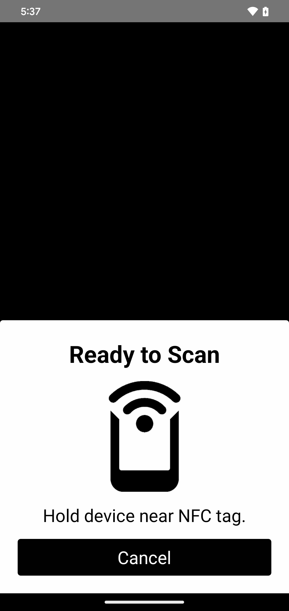
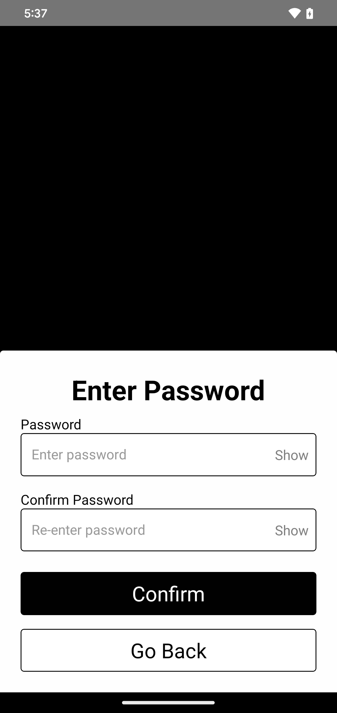

# Card Issuance & Login

The `Issuance` component facilitates a step by step process for securely logging in using **PhysiKey cards**. It provides an interactive flow for NFC scanning, password validation, and handling errors or success, ensuring a smooth user experience when accessing the account.

This component is displayed as a modal, allowing users to complete the login process without leaving the current screen. Its visibility is controlled by state.

<div style="display: grid; grid-template-columns: repeat(5, 1fr); gap: 16px;">
  <div style="text-align: center;">
    
  </div>
  <div style="text-align: center;">
    
  </div>
  <div style="text-align: center;">
    
  </div>
  <div style="text-align: center;">
    
  </div>
  <div style="text-align: center;">
    
  </div>
</div>

## Setup Process for Unconfigured PhysiKey Cards
If the PhysiKey card scanned has not been set up yet, the `Issuance` component will guide the user through a setup process. Once the setup is complete, users will be able to access their account securely. This ensures a smooth transition from initial card scanning to successful login, even for first time users.

## Props
- `color` (string, optional): A hex value that determines the theme color of the component. It allows you to customize the color of buttons to match your theme.
- `rpcUrl` (string): The URL of the RPC endpoint used to interact with the blockchain network.
- `visible` (boolean): Determines if the `Issuance` component is visible or not. It controls the modal's visibility on the screen.
- `closeIssuance` (function): A function to close the `Issuance` modal. This is typically tied to the state change for `visible`.

---

## Usage

### 1. Import 
To use the `Issuance` component, import it into your React component:

````tsx
import { Issuance } from "physikeyRN"
````

### 2. Implement 
Use the modal inside your component and control its visibility with state:

````tsx
const [isVisible, setIsVisible] = useState(false);

return (
  <>
    <Button title="Issue Card" onPress={() => setIsVisible(true)} />
    <Issuance 
        color="#4A90E2"  // (Optional) Custom theme color 
        rpcUrl="https://example.com/rpc"  // RPC URL
        visible={isVisible} 
        closeIssuance={() => setIsVisible(false)} 
    />
  </>
);
````

