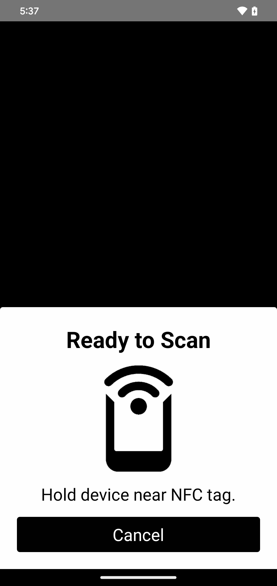
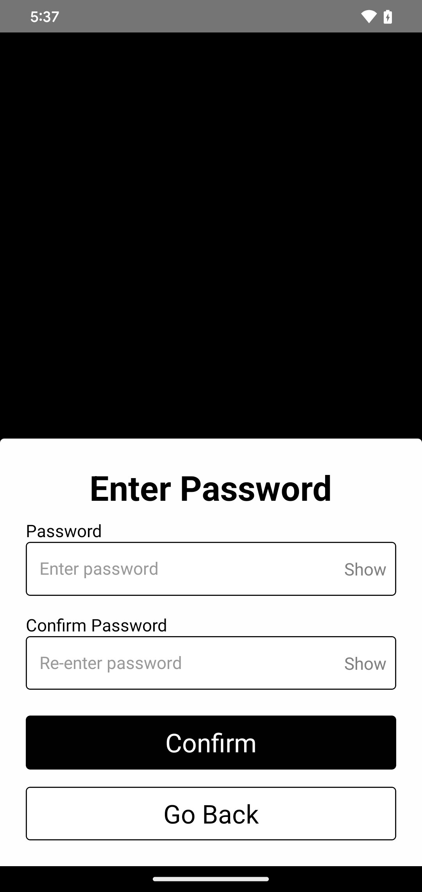
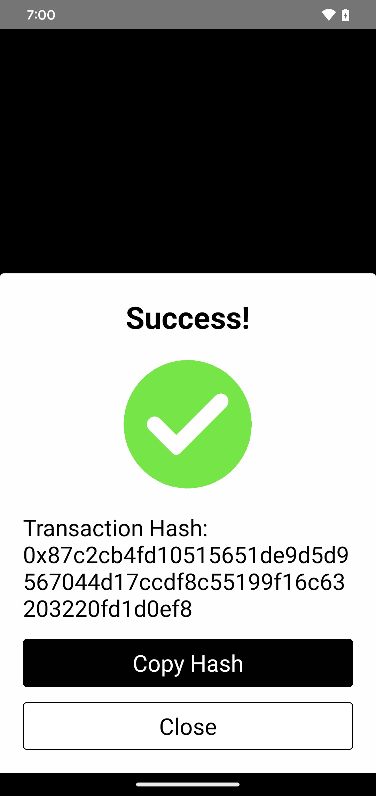

# Sign Transaction

The `Sign` component facilitates signing transactions by using **PhysiKey cards**. It provides a step by step process to handle NFC data, password validation, and transaction execution. The component is designed to work with both **Externally Owned Accounts (EOA)** and **Simple Smart Accounts (SSA)**.

This component is displayed as a modal, allowing users to complete the signing process without leaving the current screen. Its visibility is controlled by state.

<div style="display: grid; grid-template-columns: repeat(3, 1fr); gap: 8px;">
  <div style="text-align: center;">
    
  </div>
  <div style="text-align: center;">
    
  </div>
  <div style="text-align: center;">
    
  </div>
</div>

## Props
- `rpcUrl` (string): The URL of the RPC endpoint used to interact with the blockchain network.
- `accountType` (string: "EOA" or "SSA"): The type of account used for signing. "EOA" stands for Externally Owned Account, and "SSA" stands for Simple Smart Account.
- `transactionData` (object): The data related to the transaction that needs to be signed (e.g., recipient address, value, data).  Varies depending on `accountType`.
- `visible` (boolean): Determines if the `Accept` component is visible or not. It controls the modal's visibility on the screen.
- `closeAccept` (function): A function to close the `Accept` modal. This is typically tied to the state change for `visible`.

---

## Usage

### 1. Import 
To use the `Sign` component, import it into your React component:

````tsx
import { Sign } from "physikey-rn"
````

### 2. Basic Usage 
Use the modal inside your component and control its visibility with state:

````tsx
import React, { useState } from 'react';
import { View, Button } from 'react-native';
import { Sign } from 'physikey-rn';

function App(): React.JSX.Element {
  const [signModal, setSignModal] = useState(false);
  const [transactionData, setTransactionData] = useState<any>(null); // State for storing transaction data

  // Sample transaction data (you would replace this with actual data)
  const exampleTransactionData = {
    to: "0xRecipientAddressHere", 
    value: Web3.utils.toWei("0.01", "ether"), 
    gas: 21000, 
    gasPrice: Web3.utils.toWei("10", "gwei"), 
    nonce: 0, 
    chainId: 1, 
  }

  const openSign = (data) => {
    // Set the transaction data and open the modal
    setTransactionData(data);
    setSignModal(true);
  };

  const closeSign = () => {
    setSignModal(false);
  };

  return (
    <View style={styles.container}>
      <Button onPress={() => { openSign(exampleTransactionData); }}>Sign With PhysiKey</Button>
      <Sign
        rpcURL="https://sepolia.base.org" // Any EVM compatable chain
        transactionData={transactionData}
        accountType="EOA" // choose EOA or SSA
        visible={signModal}
        closeSignModal={closeSign}
      />
    </View>

  );
};
export default App;
````

### Transaction Data & Important Considerations
Ensure the transaction data includes the necessary information: 
- **SSA Transactions**: By default are set up to use a Pimlico paymaster with `permissionless 0.1.31`.  Example transaction coming soon.

### 3. Sign Process
Once the Modal is opened, the user will:
1. Scan their NFC card.
2. Enter their password.
3. The `Sign` component will sign the transaction.
4. After signing, the transaction will be sent for execution and a transaction hash will be provided.

---

For any questions or concerns please **[reach out](https://www.physikey.xyz/)** 